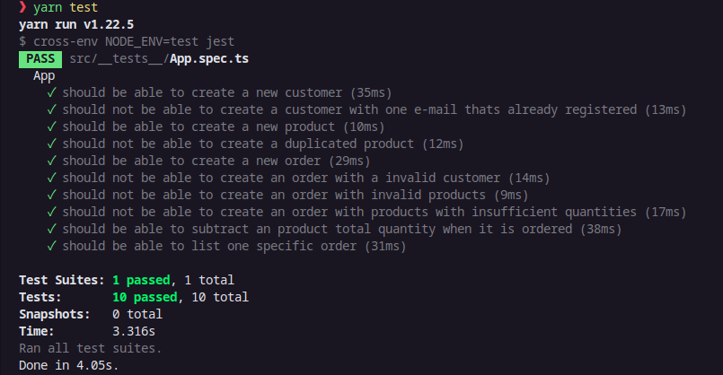
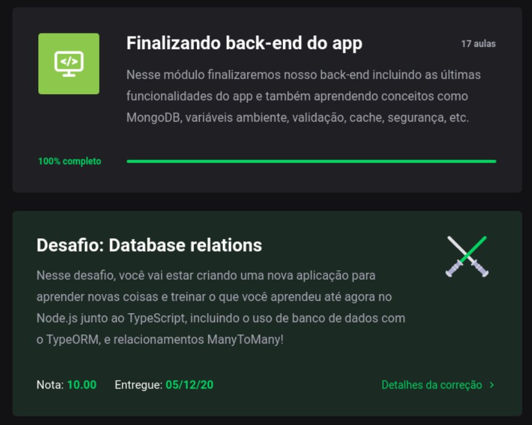

<h3 align="center">Bootcamp GoStack 13 - Desafio: Relacionamentos com banco de dados no Node.js</h3>

Nesse desafio, devemos criar uma nova aplicação para aprender novas coisas e treinar o que aprendemos até agora no Node.js junto ao TypeScript, incluindo o uso de banco de dados com o TypeORM, e o relacionamento ManyToMany!

Essa aplicação deve permitir a criação de clientes, produtos e pedidos, onde o cliente podee gerar novos pedidos de compra de certos produtos, como um pequeno e-commerce.

#### Para esse desafio temos os seguintes testes:

- should be able to create a new customer
- should not be able to create a customer with one e-mail thats already registered
- should be able to create a new product
- should not be able to create a duplicated product
- should be able to create a new order
- should not be able to create an order with a invalid customer
- should not be able to create an order with invalid products
- should not be able to create an order with products with insufficient quantities
- should be able to subtract an product total quantity when it is ordered
- should be able to list one specific order

## Clonar e Testar

`$ git clone https://github.com/Newton-Duarte/gostack-typeorm-relations`

`$ cd gostack-typeorm-relations`

`$ yarn` ou `$ npm install`

`$ yarn test` ou `$ npm run test`

